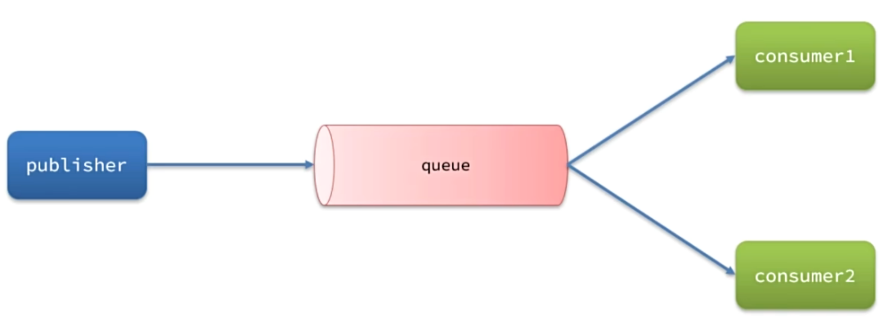
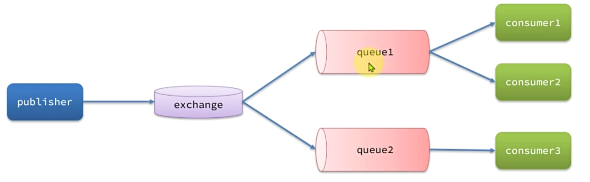
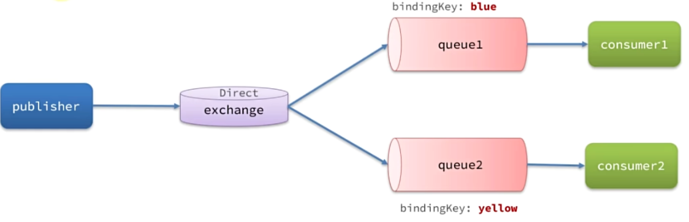
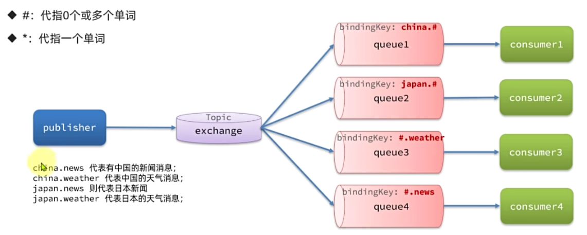
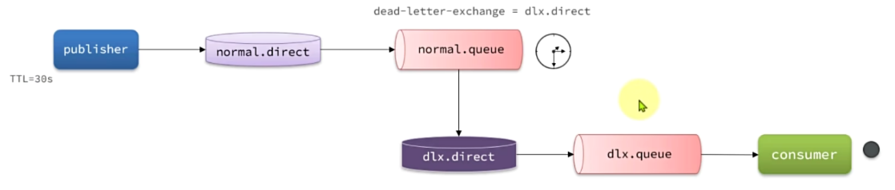
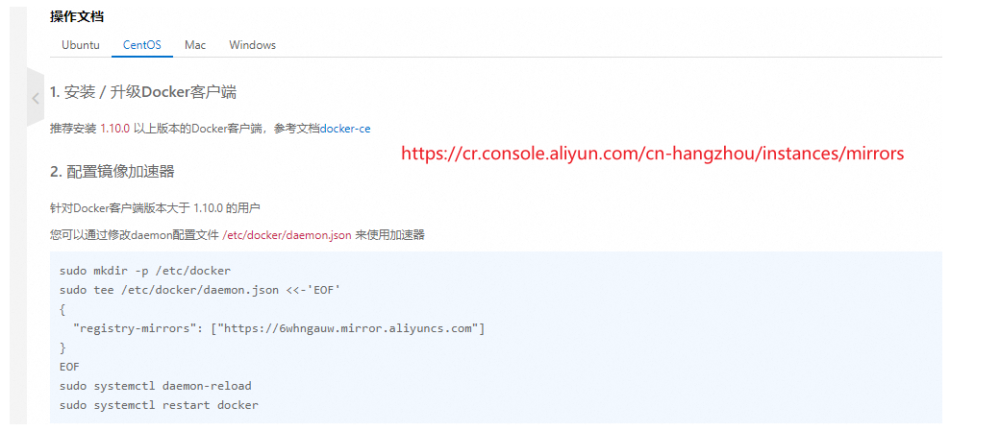
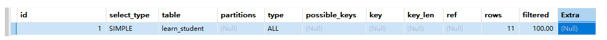
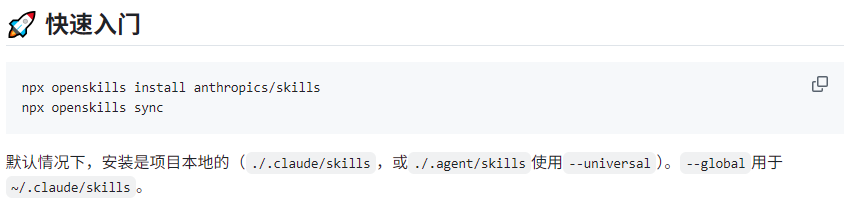

1、linux

```Linux
1、查看防火墙的状态（dead代表关闭 running代表已经开启）
systemctl status firewalld
2、查看防火墙所有开放的端口
firewall-cmd --list-ports
3、开启防火墙
systemctl start firewalld
4、开放指定端口号（同时注意要在云服务器开放端口）
firewall-cmd --permanent --add-port=80/tcp
5、重启防火墙使配置生效
firewall-cmd --reload
6、 查询指定端口是否有进程守护，用如下命令grep对应端口（以80端口为例）
netstat -nalp | grep 80
7、关闭防火墙
systemctl stop firewalld
8、禁止开机启动防火墙
systemctl disable firewalld
9、永久开启防火墙（启用开机自启）
systemctl enable firewalld
10、查看某用户的所有进程
top -u [用户名]
11、查看所有端口
netstat -ntlp
windows:
netstat -ano
taskkill /f /t /pid "进程PID"
12、在nacos/bin目录中，输入命令启动Nacos：
sh startup.sh -m standalone

13、yum相关
yum clean all
yum makecache
```

13、关于git

```
branch	checkout	merge	clone
起别名：remote add
push and pull 最后要加分支名字
ssh://git@192.168.88.110:10022/wangenin/leetcode.git
git@192.168.88.110:wangenin/leetcode.git
```

15、docker命令

```
1、保存镜像为tar
docker save -o [保存的目标文件名称] [镜像名称]
如：docker save -o nginx.tar nginx:latest
2、加载镜像
docker load -i nginx.tar
3、删除镜像
docker rmi nginx:latest
4、创建并运行nginx容器的命令
docker run --name containerName -p 80:80 -d nginx
5、进入镜像
docker exec -it 名称 bash
6、构建镜像
docker build -t javaweb:1.0 .
7、Dockerfile
FROM java:8-alpine
COPY ./app.jar /tmp/app.jar
EXPOSE 8090
ENTRYPOINT java -jar /tmp/app.jar
8、docker-compose up -d
9、推送、拉取镜像、推送镜像到私有镜像服务必须先tag
docker tag nginx:latest 192.168.150.101:5555/nginx:1.0
10、推送镜像
docker push 192.168.150.101:5555/nginx:1.0
11、拉取镜像
docker pull 192.168.150.101:5555/nginx:1.0
12、停止所有运行中的容器
docker stop $(docker ps -aq)
13、删除所有容器
docker rm $(docker ps -aq)
14、删除所有镜像
docker rmi $(docker images -aq)
```

16、创建vue项目

```
新：
npm create vue@latest
旧：
vue create 项目名
```

17、maven下载jar包指令

```
mvn dependency:resolve -Dclassifier=sources
```

18、jdbc

```
jdbc:mysql:///?serverTimezone=UTC&userUnicode=true&useSSL=false&characterEncoding=utf-8
```

19、linux常用命令

```
ls -a -l -h: -a显示隐藏文件 -l -h显示大小
mkdir -p: -p嵌套创建文件夹
cat more：cat：打出完，more：翻页
which cd、find / -name "test"
echo 打印 可用``
tail -f -n 5 阻塞输出
grep -n 查找关键字 文件：-n行数
wc -c -m -l -w ：字节数、字符数、单词数、字符数
chmod chown -R 对文件夹同样修改
chown 用户:用户组 文件
yum -y install remove search 软件
ln -s 源 现在 创建软连接
systemctl start stop status enable disable
systemctl start stop status enable disable 服务名
netstar -ntlp 查看端口
ps -ef 查看进程
network 网卡
ssh root@8.130.110.183
权限：chmod 创建文件：touch
```

20、docker配置

```
mysql:
	docker run -d --restart=always --name docker-mysql57 \
	-e MYSQL_ROOT_PASSWORD=Koi@j98 \
	-e TZ=Asia/Shanghai \
	-p 3357:3306 \
	-v /root/mysql57/conf:/etc/mysql/conf.d \
	-v /root/mysql57/data:/var/lib/mysql -d docker.m.daocloud.io/mysql:5.7 \
	--lower_case_table_names=1
	
nacos:
	docker run -d \
	-e prefer_host_mode=192.168.88.110 \
	-e MODE=standalone \
	-v /root/nacos/logs:/home/nacos/logs \
	-v /root/nacos/init.d/custom.properties:/home/nacos/init.d/custom.properties \
	-p 8848:8848 --name docker-nacos nacos/nacos-server:1.4.1

minio:
	docker run -p 9000:9000 -p 9090:9090 \
	--net=host \
	--name docker-minio \
	-d \
	-e "MINIO_ACCESS_KEY=minioadmin" \
	-e "MINIO_SECRET_KEY=minioadmin" \
	-v /root/minio/data:/data \
	-v /root/minio/config:/root/.minio \
	minio/minio:RELEASE.2022-09-07T22-25-02Z.fips server \
	/data --console-address ":9090" -address ":9000"
	
xxl-job-admin:
	docker run -d --name docker-xxl-job-admin -p 8088:8080 \
	-e PARAMS="\
	--spring.datasource.url=jdbc:mysql://192.168.88.110:3306/xxl_job?Unicode=true&characterEncoding=UTF-8&useSSL=false \
	--spring.datasource.username=root \
	--spring.datasource.password=jtt521.nn" \
	-v /root/xxl-job/admin/logs:/data/applogs \
	--privileged=true \
	xuxueli/xxl-job-admin:2.3.1

ES:
	docker run --name docker-ES -d -e ES_JAVA_OPTS="-Xms512m -Xmx512m" -e "discovery.type=single-node" -p 9200:9200 -p 9300:9300 elasticsearch:7.12.1

ik分词器:(进入容器直接运行)docker exec -it <容器id> /bin/bash
	./bin/elasticsearch-plugin install https://github.com/medcl/elasticsearch-analysis-ik/releases/download/v7.12.1/elasticsearch-analysis-ik-7.12.1.zip

kibana:
	docker run -d \
	--name docker-kibana \
	-e ELASTICSEARCH_HOSTS=http://192.168.88.110:9200 \
	-p 5601:5601  \
	kibana:7.12.1

redis:
	docker run --name docker-redis --restart=always -p 6379:6379 -d docker-0.unsee.tech/redis:7.2 --requirepass 'Koi@j98'

rabbitmq:
	docker run \
	-e RABBITMQ_DEFAULT_USER=guest \
	-e RABBITMQ_DEFAULT_PASS=guest \
	--name docker-rabbitmq \
	--hostname rabbitmqone \
	-p 15672:15672 \
	-p 5672:5672 \
	-d \
	rabbitmq:3-management
	
gogs:
	docker run -d --name=docker-gogs -p 10022:22 -p 10880:3000 -v /root/gogs/data:/data gogs/gogs:0.13.0
	
	
dm：
docker run -d \
    --name docker-dm \
    -p 5236:5236 \
    --restart=always \
    --privileged=true \
    -v /root/DM8:/opt/dmdbms/data \
    -e PAGE_SIZE=16 \
    -e EXTENT_SIZE=32 \
    -e BLANK_PAD_MODE=1 \
    -e LOG_SIZE=1024 \
    -e UNICODE_FLAG=1 \
    -e LENGTH_IN_CHAR=1 \
    -e LD_LIBRARY_PATH=/opt/dmdbms/bin \
    -e INSTANCE_NAME=DM8 \
    -e CHARSET=1 \
    -e CASE_SENSITIVE=0 \
    dm8_single:dm8_20240715_rev232765_x86_rh6_64


docker-registry-ui:docker-compose.yml
	version: '3.0'
	services:
	  docker-registry:
		image: registry
		volumes:
		  - ./registry/data:/var/lib/registry
	  docker-ui:
		image: joxit/docker-registry-ui:static
		ports:
		  - 5555:80
		environment:
		  - REGISTRY_TITLE=王文彬docker私有仓库
		  - REGISTRY_URL=http://docker-registry:5000
		depends_on:
		  - docker-registry
		  
nginx:
	docker run --name docker-nginx -p 80:80 \
	-v /root/nginx/conf/nginx.conf:/etc/nginx/nginx.conf \
	-v /root/nginx/conf/conf.d:/etc/nginx/conf.d \
	-v /root/nginx/logs:/var/log/nginx \
	-v /root/nginx/html:/usr/share/nginx/html \
	-d nginx:1.24.0
```

21、小程序秘钥

```
wx45326c22b42fb6cf
5f7aa89005584a4f83be03d85aa73df6
```

22、html

```
常见块元素：<h1>~<h6><p><div><ul><ol><li>
常见行内元素：<a><strong><b><em><i><del><s><ins><u><span>
常见行内块元素：<input/><td>
```

23、注册表

```
计算机\HKEY_LOCAL_MACHINE\SOFTWARE\Microsoft\Windows\CurrentVersion\Explorer\MyComputer\NameSpace
```

23、js事件类型

```
鼠标：click 点击 mouseenter 鼠标经过 mouseleave 鼠标离开 => 不支持冒泡
			   mouseover          mouseout => 支持冒泡
焦点事件：focus 获取焦点 blur 失去焦点
键盘触发：keydown 键盘按下 keyup 键盘抬起
表单输入：input 用户输入触发
```

24、linux环境变量

```
# set java environment
JAVA_HOME=/usr/local/jdk17
PATH=$JAVA_HOME/bin:$PATH
export JAVA_HOME PATH
```

25、windows杀进程

```shell
taskkill /f /pid 1600 /t
```

26、挂载本地yum镜像源

```
mkdir /mnt/centos
mount /dev/sr0 /mnt/centos

yum clean all
yum makecache

```

27、RabbitMQ有哪些工作模式？

- simple简单模式


- work 工作模式



- pub/sub 发布订阅模式 fanout 广播模式 交换机将消息放在所有队列



- Routing 路由模式 direct 交换机



- Topic 主题模式



延迟消息



28、设置淘宝源以及恢复官方源

```
# 最新地址 淘宝 NPM 镜像站喊你切换新域名啦!
npm config set registry https://registry.npmmirror.com

npm config set registry https://registry.npmjs.org

```

29、docker加速



```
sudo mkdir -p /etc/docker
sudo tee /etc/docker/daemon.json <<-'EOF'
{
  "registry-mirrors": ["https://6whngauw.mirror.aliyuncs.com"]
}
EOF
sudo systemctl daemon-reload
sudo systemctl restart docker
```

```
telnet   查看日志journalctl -u minio.service
使用journalctl -u minio.service查看日志
日志打在/usr/local/miniodata/logs/minio.log
systemctl restart 服务名称.service
```

30、SpringBoot的配置文件加载

```
1、resources
2、resources/config
3、jar包目录下
4、jar包目录下，创建config
spring.config.location
spring.config.additional-location
```

```
@DateTimeFormat解析请求
@JsonFormat解析响应与请求
```

```
JVM：
JVM参数：
-Xss<size>：虚拟机栈大小
-Xmx<size>：堆空间最大大小

工具：
jps工具：查看当前系统中有那些java进程
jmap工具：查看堆内存占用情况
jconsole工具：图形界面的，多功能监测工具
```

SQL调优：



**select_type：**查询类型，`SIMPLE` 表示这是一个简单查询。

**table：**当前行对应的表名。

**partitions：**

**type：**

**possible_keys：**

**key：**

**key_len：**

**ref：**

**rows：**

**filtered：**

**Extra：**

```
SQL的执行顺序：
(1) FROM [Left Table]
(2) ON (Join Condition)
(3) JOIN [Right Table]
(4) WHERE
(5) GROUP BY
(6) HAVING
(7) ORDER BY
(8) SELECT
(9) DISTINCT
(10) LIMIT / OFFSET
```



```
npx openskills install anthropics/skills
npx openskills sync
```

