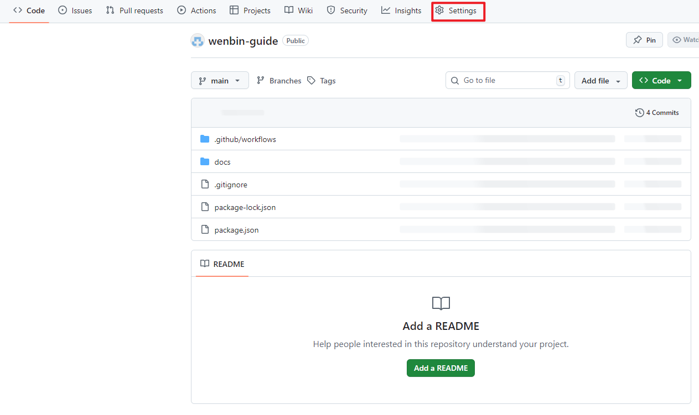
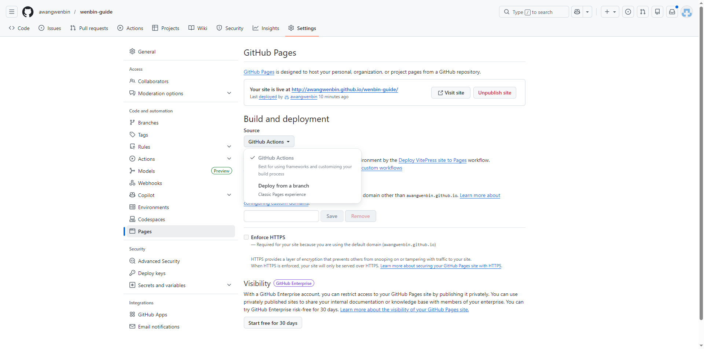
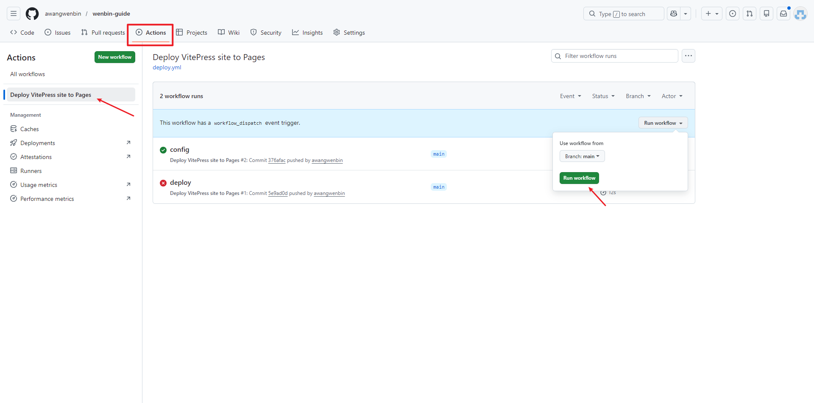

# VitePress 部署到 GitHub Pages

本文介绍如何将 VitePress 文档站点自动部署到 GitHub Pages。

---

## 前置条件

- 已创建 GitHub 仓库<br/>
例如仓库地址为：`https://github.com/awangwenbin/wenbin-guide`
- 本地 VitePress 项目可正常运行

---

## 1. 配置 VitePress

### 1.1 设置 base 路径

在 `docs/.vitepress/config.mts` 中配置 `base` 选项，值为仓库名：

```typescript
import { defineConfig } from 'vitepress'

export default defineConfig({
  base: '/你的仓库名/',
  title: "文档标题",
  description: "文档描述",
  // ...
})
```

例如，如果你的仓库地址是 `https://github.com/awangwenbin/wenbin-guide`，则：

```typescript
base: '/wenbin-guide/',
```

> 如果部署到自定义域名，可以省略 `base` 配置。

---

## 2. 创建 GitHub Actions 工作流

### 2.1 创建工作流文件

在项目根目录创建 `.github/workflows/deploy.yml`：

```yaml
name: Deploy VitePress site to Pages

on:
  push:
    branches: [main]  # 如果你的默认分支是 master，改成 master
  workflow_dispatch:

permissions:
  contents: read
  pages: write
  id-token: write

concurrency:
  group: pages
  cancel-in-progress: false

jobs:
  build:
    runs-on: ubuntu-latest
    steps:
      - name: Checkout
        uses: actions/checkout@v4
        with:
          fetch-depth: 0  # 如果你用了 lastUpdated，这个必须

      - name: Setup Node
        uses: actions/setup-node@v4
        with:
          node-version: 20
          cache: npm

      - name: Setup Pages
        uses: actions/configure-pages@v4

      - name: Install dependencies
        run: npm ci

      - name: Build with VitePress
        run: npm run docs:build

      - name: Upload artifact
        uses: actions/upload-pages-artifact@v3
        with:
          path: docs/.vitepress/dist

  deploy:
    environment:
      name: github-pages
      url: ${{ steps.deployment.outputs.page_url }}
    needs: build
    runs-on: ubuntu-latest
    name: Deploy
    steps:
      - name: Deploy to GitHub Pages
        id: deployment
        uses: actions/deploy-pages@v4
```

---

## 3. 配置 GitHub Pages

### 3.1 打开仓库设置

进入 GitHub 仓库 → **Settings** → **Pages**





### 3.2 配置部署源

在 **Build and deployment** 部分：

| 选项 | 设置值 |
|------|--------|
| Source | **GitHub Actions** |

> 选择 GitHub Actions 后，系统会自动识别工作流文件。

---

## 4. 触发部署

### 4.1 自动部署

每次推送到 `main` 分支时，会自动触发部署。

### 4.2 手动部署

进入仓库 → **Actions** → **Deploy VitePress site to Pages** → **Run workflow**

---

## 5. 访问站点

部署完成后，站点地址为：

```
https://你的用户名.github.io/仓库名/
```

例如：
```
https://awangwenbin.github.io/wenbin-guide/
```

---

## 6. 常见问题

### 6.1 样式或资源加载失败

检查 `base` 配置是否正确，确保与仓库名一致。

### 6.2 部署后页面空白

检查构建输出目录是否正确，默认为 `docs/.vitepress/dist`。

### 6.3 工作流运行失败

1. 检查 `package.json` 中是否有 `docs:build` 脚本
2. 确保 `docs/.vitepress/dist` 目录存在
3. 查看 Actions 日志获取详细错误信息

---

## 参考

- [VitePress 官方文档 - 部署指南](https://vitepress.dev/guide/deploy)
- [GitHub Pages 文档](https://docs.github.com/zh/pages)
